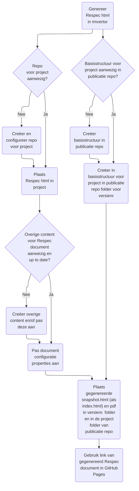

# Het VNG-R Respec proces

Zie de '[Flowchart syntax](https://mermaid.js.org/syntax/flowchart.html)' voor een uitleg van de syntax.

<figure>
    

<figcaption>Het VNG-R Respec proces (Mermaid voorbeeld)</figcaption>
</figure>
