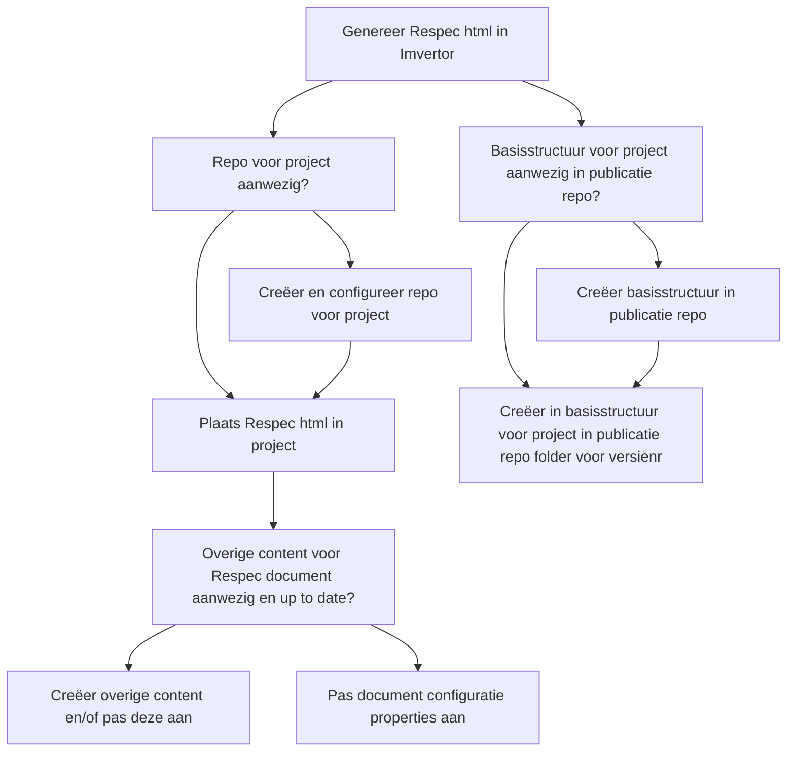

# Mermaid diagram

<figure>

```mermaid
graph TD;
    A[Genereer Respec html in Imvertor]-->B[Repo voor project aanwezig?];
    B[Repo voor project aanwezig?]-->C[Creëer en configureer repo voor project];
    B[Repo voor project aanwezig?]-->D[Plaats Respec html in project];
    C[Creëer en configureer repo voor project]-->D[Plaats Respec html in project];
    D[Plaats Respec html in project]-->E[Overige content voor Respec document aanwezig en up to date?];
    E[Overige content voor Respec document aanwezig en up to date?]-->F[Creëer overige content en/of pas deze aan];
    E[Overige content voor Respec document aanwezig en up to date?]-->G[Pas document configuratie properties aan];
    A[Genereer Respec html in Imvertor]-->H[Basisstructuur voor project aanwezig in publicatie repo?];
    H[Basisstructuur voor project aanwezig in publicatie repo?]-->I[Creëer basisstructuur in publicatie repo];
    H[Basisstructuur voor project aanwezig in publicatie repo?]-->J[Creëer in basisstructuur voor project in publicatie repo folder voor versienr];
    I[Creëer basisstructuur in publicatie repo]-->J[Creëer in basisstructuur voor project in publicatie repo folder voor versienr];
```

<figcaption>Mermaid voorbeeld</figcaption>
</figure>
